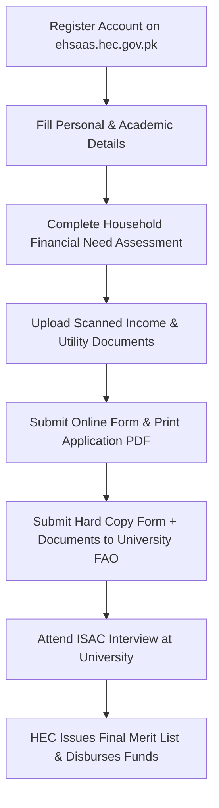

# Ehsaas Undergraduate Scholarship 2026 Online Apply: HEC Portal Check, 100% Tuition Fee & Rs 4,000 Stipend Guide

To apply for the HEC Ehsaas Undergraduate Scholarship 2026, submit your online application through the official Higher Education Commission portal at ehsaas.hec.gov.pk. The federal program awards 50,000 annual need-based scholarships covering 100% full university tuition fees plus a Rs. 4,000 monthly living stipend for undergraduate students enrolled in 135+ public sector universities across Pakistan.

---

## What is the HEC Ehsaas Undergraduate Scholarship Project?

The Higher Education Commission (HEC) Ehsaas Undergraduate Scholarship Project—now administered under the Benazir Higher Education Scholarship initiative—is Pakistan’s largest need-based undergraduate grant program. Designed to eliminate financial barriers preventing talented students from low-income households from completing university education, the project awards 50,000 new scholarships each academic year.

Unlike merit-exclusive programs where only the highest test scorers qualify regardless of financial background, this federal initiative evaluates financial need alongside baseline academic admission. Once awarded, the scholarship covers the student’s complete 4-year or 5-year degree duration, provided they maintain satisfactory academic progress and continuous enrollment.

### Comprehensive Coverage: 100% Tuition Fee + Rs. 4,000 Monthly Living Stipend

The scholarship package delivers two major financial benefits throughout the undergraduate degree:

1. **100% Full Tuition Fee Coverage**: HEC directly reimburses the public sector university for the student's complete institutional costs, including admission fees, semester tuition, laboratory charges, library fees, and mandatory examination costs.
2. **Monthly Living & Maintenance Stipend (Rs. 4,000 / Month)**: Beneficiary students receive an annual living allowance of Rs. 40,000 to Rs. 50,000 (disbursed as Rs. 4,000 per month across the academic session). This cash stipend is transferred directly into the student's personal designated bank account to cover books, transport, study supplies, and daily living expenditures.

### 50% Quota for Female Students & 2% for Special Persons (Disabilities)

To address national gender disparities in higher education, the federal government mandates that **50% of all 50,000 annual scholarships are strictly reserved for female applicants**. This policy has significantly boosted female enrollment in engineering, medical sciences, computer science, and agriculture across underdeveloped rural districts.

Additionally, a dedicated **2% quota is legally reserved for students with disabilities (special persons)** holding official NADRA disability CNICs or Special Medical Board certificates. Candidates from remote and disadvantaged regions—including Balochistan, interior Sindh, Khyber Pakhtunkhwa's merged tribal districts, Azad Jammu & Kashmir, and Gilgit-Baltistan—are given high priority during the institutional means-testing evaluation.

---

## Who is Eligible? Complete Criteria for 4-Year BS Degree Programs

Before beginning your online application on the HEC portal, review the mandatory eligibility criteria to ensure your admission status qualifies.

### Eligible Candidates (Public University 1st / 2nd Semester Students)

You are eligible to apply if you meet all of the following requirements:

- **Enrolled in an HEC-Recognized Public Sector University**: You must be a regular, newly admitted student enrolled in a 4-year or 5-year undergraduate degree program (BS, BBA, BSc, BE, MBBS, Pharm-D, DVM, or equivalent) at one of the 135+ participating public universities.
- **First or Second Semester Enrollment**: Applications are accepted exclusively from undergraduate students currently enrolled in their 1st or 2nd semester (first academic year). Continuing students in 3rd semester or beyond are ineligible to apply for new awards.
- **Family Income Below Poverty Threshold**: Household monthly income must typically be below Rs. 45,000 (though candidates from families earning up to Rs. 60,000 may be considered if supported by a high family dependency ratio or chronic medical expenses).
- **Merit-Based Regular Admission**: The student must have secured admission on open merit in the university's regular (morning) program.

### Ineligible Categories (Evening Programs, Private Universities & Dual Scholarships)

The following student categories are **strictly ineligible** and will be disqualified:

| Student Category | Eligibility Status | Reason for Ineligibility |
|---|---|---|
| **Private University Students** | ❌ Ineligible | Scheme applies exclusively to 135+ HEC-recognized public sector universities. |
| **Evening / Self-Finance Programs** | ❌ Ineligible | Only regular open-merit morning program admissions qualify for federal subsidies. |
| **Distance Learning / Affiliated Colleges** | ❌ Ineligible | External degree programs, private candidates, and non-constituent private colleges are excluded. |
| **Existing Scholarship Holders** | ❌ Ineligible | Students already receiving any other full scholarship (PEEF, HEC Need-Based, BEEF, or foreign grant) cannot hold dual awards. |
| **Postgraduate / Master / MPhil / PhD** | ❌ Ineligible | Scheme is strictly restricted to undergraduate (Bachelor’s) degree programs. |
| **Family Income Exceeding Threshold** | ❌ Ineligible | High-income households fail the mandatory financial means-testing assessment. |

---

## Step-by-Step Online Application Process on the HEC Portal (`ehsaas.hec.gov.pk`)

Applying for the scholarship requires completing an online form on the HEC e-portal and submitting hard copies to your university's Financial Aid Office.

### Step 1: Create Your HEC E-Portal Profile & Enter Academic Details

1. Open your web browser and navigate to the official HEC application portal at `https://ehsaas.hec.gov.pk/` (or `https://scholarships.hec.gov.pk/`).
2. Click **"Register"** to create a new applicant profile. Enter your 13-digit CNIC/B-Form number, active email address, and mobile phone number.
3. Verify your registration via the 6-digit One-Time Password (OTP) sent to your registered email and mobile phone.
4. Log into the portal and navigate to the **"Ehsaas Undergraduate Scholarship Project"** dashboard.
5. Enter your personal profile information, permanent/current postal address, and complete academic history (Matriculation/O-Level marks, Intermediate/FSc grades, and university enrollment registration number).

### Step 2: Complete the Financial Need Assessment & Family Income Section

1. **Family Earning Members**: Declare the employment status, profession, and monthly earnings of your father, mother, or guardian.
2. **Household Expenditures**: Enter accurate monthly utility costs (average electricity, gas, and water bill amounts over the last 6 months).
3. **Residential Status**: Specify whether your family resides in an owned house, rented property (enter monthly rent amount), or ancestral village home.
4. **Educational Expenses of Siblings**: Enter the number of schooling/college-going brothers and sisters along with their monthly tuition fees.
5. **Medical Expenses**: Record any chronic illness treatments or ongoing monthly medical costs for dependent family members.

### Step 3: Print the Completed Application Form & Attach Supporting Documents

1. Review all entered data carefully. Once submitted online, application data cannot be modified.
2. Click **"Submit Application"** to finalize your digital submission.
3. Download and print the generated **Application Form PDF**.
4. Affix recent passport-size photographs and your signature (along with your father/guardian’s signature) in the designated declaration sections.

---

## Mandatory Documents Required for University Financial Aid Office (FAO) Submission

After submitting online, you must assemble a physical application docket and submit it to your university's Financial Aid Office (FAO) before the published institutional deadline. Attach clear photocopies of the following documents:

1. **Printed HEC Application Form**: Duly signed by the student and parent/guardian.
2. **CNIC / B-Form Copies**: Photocopy of the applicant’s CNIC or NADRA B-Form, along with photocopies of CNICs of father, mother, and guardian.
3. **Salary Slip / Income Certificate**:
   - For salaried parents: Official monthly salary slip from the employer.
   - For daily wage, business, or agricultural workers: Attested Income Certificate issued by the local Union Council Chairman, Tehsildar, or Assistant Commissioner.
4. **Utility Bills (Last 6 Months)**: Paid copies of electricity, gas, water, and landline telephone bills.
5. **House Rent Agreement**: Copy of the tenancy contract (if living in a rented house).
6. **Fee Vouchers of Siblings**: Fee slips of school, college, or university-going siblings.
7. **Medical Bills & Doctor Certificates**: Supporting proof if claiming chronic medical expenses for family members.
8. **University Admission Fee Challan**: Copy of the paid 1st-semester university admission fee voucher.
9. **Death / Disability Certificate (If Applicable)**: Official NADRA death certificate if the father/guardian is deceased, or disability certificate for special persons.

---

## The Selection Procedure: University Financial Aid Office & ISAC Interview

Securing the scholarship involves a two-stage institutional evaluation process conducted directly on your university campus.

### Document Scrutiny by University Financial Aid Office (FAO)

Once your physical application docket is submitted, the university Financial Aid Office conducts detailed document verification. Officials cross-check declared income against electricity consumption units, sibling tuition fees, and local economic benchmarks. Incomplete dockets or applications lacking valid Union Council income certificates are marked for discrepancy or rejected.

### What Happens During the ISAC Interview? (Preparation Guide)

Shortlisted candidates are invited to appear before the **Institutional Scholarship Award Committee (ISAC)**, chaired by the Vice-Chancellor or Dean and comprised of senior faculty members, financial aid directors, and regional civil society representatives.

The ISAC panel conducts a 5 to 10-minute personal interview to evaluate genuine financial distress. Key questions commonly asked include:

- *What is your father’s/guardian's primary source of daily livelihood and monthly income?*
- *How does your family manage household expenses and utility bills relative to declared income?*
- *Do you have any elder earning brothers or overseas financial support?*
- *Why did you choose this degree program, and what are your career aspirations?*
- *How will this scholarship impact your ability to complete your university education?*

> **Interview Success Tip**: Answer all questions honestly and calmly. Bring original utility bills, original income certificates, and university fee slips with you to the interview room in case the panel asks to inspect the original documents.

---

## How to Check HEC Ehsaas Scholarship Status & Merit List Online

To verify whether you have been selected for the scholarship:

1. **Log into HEC E-Portal**: Visit `https://ehsaas.hec.gov.pk/` and check your application status under the **"Application Status"** tab (displays: *Submitted*, *Under Review by University*, *Shortlisted for ISAC*, or *Approved*).
2. **University FAO Notice Board & Website**: Every participating public university publishes the official **ISAC Provisional Merit List** and **Final Awardee List** on its official website and financial aid notice boards.
3. **Deed of Agreement Submission**: Selected students must sign a formal legal **Deed of Agreement on non-judicial stamp paper** (available at the university FAO) agreeing to maintain satisfactory academic grades and not accept dual scholarships.
4. **Disbursement of Funds**: The university refunds the paid 1st-semester tuition fee directly to the student, and HEC opens an automated bank account link for monthly stipend transfers.

---

## Troubleshooting Common Application & Portal Errors

### 1. HEC Portal OTP Not Received on Mobile or Email
If you do not receive the 6-digit verification code during registration:
- Check your email's Spam/Junk folder.
- Ensure your mobile number is not ported (MNP) to another network, as promotional SMS gateways frequently fail on converted SIMs. Use an un-ported mobile number or verify via email OTP.

### 2. Income Certificate Rejected by Financial Aid Office
Handwritten income notes on plain paper are automatically rejected. Ensure your family income certificate is typed on official Union Council letterhead, stamped by the UC Secretary/Chairman or a Grade-17 Gazetted Officer, and clearly states monthly family income in Pakistani Rupees.

### 3. Forgot HEC Portal Login Password
Click the **"Forgot Password"** link on the HEC login screen, enter your registered 13-digit CNIC number, and follow the password reset link sent to your registered email address.

---

## Frequently Asked Questions (FAQ)

### What is the monthly stipend amount for the HEC Ehsaas Undergraduate Scholarship?
The monthly stipend amount is Rs. 4,000 per month, totaling Rs. 40,000 to Rs. 50,000 per academic year, paid directly to the student's bank account in addition to 100% full university tuition fee reimbursement.

### Can students in private universities apply for the Ehsaas Undergraduate Scholarship?
No, the Ehsaas Undergraduate Scholarship is strictly restricted to regular undergraduate students enrolled in 135+ HEC-recognized public sector universities and degree awarding institutions across Pakistan.

### What is the family income limit to qualify for the Ehsaas Scholarship?
The general family monthly income threshold is under Rs. 45,000 per month, though students from households earning up to Rs. 60,000 may be considered by university committees if they have large family sizes or high medical expenses.

### How can I apply for the HEC Ehsaas Scholarship online?
You can apply online by creating an applicant profile on the official HEC portal at `ehsaas.hec.gov.pk`, completing the academic and financial need assessment sections, and submitting the printed form with supporting documents to your university Financial Aid Office.

### Is there a quota reserved for female students in this scholarship?
Yes, exactly 50% of all 50,000 annual scholarships are legally reserved for female undergraduate students across all academic disciplines to promote women's higher education.

### Can 2nd year or 3rd year university students apply for a new scholarship?
No, new scholarship applications are accepted exclusively from undergraduate students enrolled in their 1st or 2nd semester (first year). Continuing students in higher semesters cannot apply for new awards.

### Are evening or self-finance students eligible for the scholarship?
No, students enrolled in evening programs, weekend shifts, self-finance seats, or executive programs are not eligible; the scholarship covers only regular morning open-merit students.

### What documents are required for the university ISAC interview?
You must bring original CNICs/B-Forms, original paid utility bills, original attested Union Council income certificate, rent agreement (if applicable), and semester fee vouchers to the ISAC interview.

### Can I apply if I am already receiving another scholarship like PEEF?
No, holding dual scholarships is strictly prohibited under HEC guidelines. If you are awarded the HEC Ehsaas Scholarship, you must surrender any other ongoing provincial or private scholarship.

### How long does the Ehsaas Undergraduate Scholarship last?
The scholarship covers the entire 4-year or 5-year duration of your undergraduate degree program, provided you maintain minimum passing CGPA standards and continuous semester enrollment.
