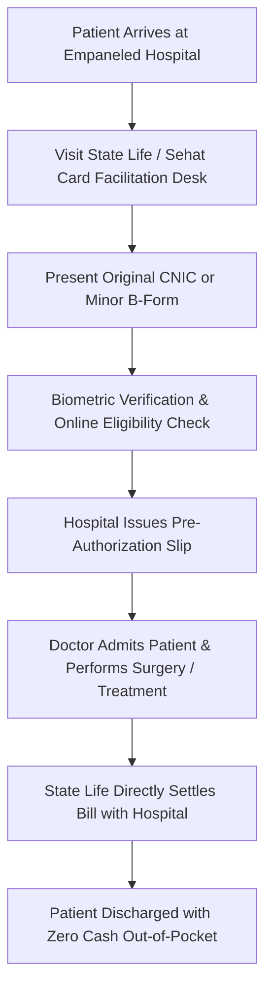

# KPK Sehat Sahulat Card Check Online 2026: 8500 SMS, 10 Lakh Treatment Coverage & Empaneled Hospital List

To check your KPK Sehat Card Plus eligibility and available balance online, send your 13-digit CNIC number without dashes via SMS to 8500 or enter it on the official portal at sehatcardplus.gov.pk. Every permanent Khyber Pakhtunkhwa resident automatically qualifies for Rs. 1,000,000 (10 Lakh) free annual inpatient healthcare coverage per family at over 1,000 empaneled hospitals across Pakistan using their original CNIC.

---

## What is KPK Sehat Card Plus and How Much Treatment is Free?

Khyber Pakhtunkhwa Sehat Card Plus (Sehat Sahulat Program) is the provincial government's flagship universal health insurance initiative, executed in collaboration with the State Life Insurance Corporation of Pakistan. Unlike targeted welfare subsidies requiring complex means-testing, Sehat Card Plus provides universal healthcare entitlement to 100% of families holding permanent residence registered on their Computerized National Identity Card (CNIC) in Khyber Pakhtunkhwa, including the merged tribal districts.

The program replaces expensive out-of-pocket medical expenditures with an automated, cashless healthcare safety net. Beneficiaries do not need a physical plastic insurance card to access medical services; an active original NADRA CNIC or juvenile B-Form acts as your direct digital health wallet across all designated public and private healthcare facilities.

### Universal Coverage Model: Rs. 1,000,000 Annual Family Health Limit

Under the 2026 Sehat Card Plus framework, every registered family unit receives an annual health coverage pool of Rs. 1,000,000 (10 Lakh PKR). This financial allocation resets automatically at the start of each fiscal cycle, ensuring that severe illness does not push vulnerable households into catastrophic medical debt.

The family health pool operates on a shared basis for all legal members recorded in NADRA's family registration database. If one family member undergoes a surgical procedure costing Rs. 250,000, the remaining Rs. 750,000 balance remains accessible for any other registered dependent within that same calendar year. In critical medical emergencies involving organ failure or complex cardiovascular interventions, specialized high-risk reserve funds can be authorized through special approval from the KP Health Department.

### Secondary Care vs. Priority Tertiary Healthcare Packages

The Sehat Card Plus coverage framework divides inpatient healthcare into two primary medical categories:

1. **Secondary Healthcare Packages (Baseline Surgical & Medical Care)**: Covers general surgical operations, maternal and child healthcare, normal vaginal deliveries, Cesarean sections (C-sections), appendectomies, gallbladder surgeries (cholecystectomy), hernia repairs, fractures, and emergency pediatric hospitalizations. Secondary packages generally allocate up to Rs. 200,000 to Rs. 300,000 per family per year.
2. **Priority Tertiary Healthcare Packages (Specialized & Chronic Care)**: Covers complex life-saving procedures including open-heart bypass surgery, coronary angioplasty and stenting, oncology treatments (cancer chemotherapy, surgical resection, and radiation therapy), end-stage renal disease dialysis, kidney transplantation, advanced neurosurgery, and multi-trauma intensive care management. These treatments utilize the comprehensive Rs. 1,000,000 family ceiling.

---

## How to Check KPK Sehat Card Eligibility Online & via 8500 SMS

Verifying whether your household is active in the Sehat Card Plus database takes less than two minutes. The KP Health Department provides two official verification gateways: quick telecommunication SMS routing and the central online portal.

### Method 1: Instant 8500 SMS CNIC Verification (Step-by-Step)

The official 8500 SMS code is the fastest method to verify eligibility directly from any mobile network (Jazz, Telenor, Zong, Ufone, or Onic):

1. **Open Your Phone's SMS App**: Create a new text message on your mobile device.
2. **Type Your 13-Digit CNIC Number**: Enter your Computerized National Identity Card number without any spaces, dashes, or special characters (e.g., `1730112345671`).
3. **Send the Message to 8500**: Transmit the text message to the official shortcode **8500**.
4. **Receive Instant Confirmation**: Within 10 to 30 seconds, you will receive an automated response from State Life confirming your eligibility status, registered district, family head identity, and panel hospital access confirmation.

> **Important Note on SMS Charges**: Standard mobile carrier SMS charges (approximately Rs. 2 plus tax) apply when sending messages to 8500. Ensure your mobile account has sufficient prepaid airtime balance before sending.

### Method 2: Sehat Card Plus Official Web Portal Check (`sehatcardplus.gov.pk`)

For families wanting to check remaining balance limits, empaneled hospital locations, or specific package limits, use the web portal:

1. Visit the official Khyber Pakhtunkhwa Sehat Card Plus portal at `https://sehatcardplus.gov.pk/`.
2. Navigate to the **"Check Eligibility" (اہلیت چیک کریں)** menu on the homepage.
3. Enter your 13-digit CNIC number in the provided search field.
4. Complete the security captcha verification code displayed on the screen.
5. Click **"Check Status"** to view your real-time coverage status, active family members linked through NADRA, and remaining treatment funds.

---

## Which Medical Treatments, Surgeries & Diseases Are Covered?

Sehat Card Plus is strictly an **inpatient hospital admission and surgical coverage program**. Understanding the exact boundary between covered hospital admissions and non-covered outpatient clinic visits prevents billing disputes during medical visits.

### Fully Covered Inpatient & Surgical Procedures

The following major medical treatments and surgeries are fully covered under cashless hospital admission:

- **Cardiology & Cardiac Surgery**: Angiography, coronary angioplasty with drug-eluting stents, coronary artery bypass grafting (CABG), pacemaker implantation, and heart valve replacement.
- **Oncology (Cancer Treatment)**: Chemotherapy cycles, radiotherapy sessions, and surgical tumor excisions across public and private cancer care centers.
- **Nephrology & Urology**: Regular hemodialysis for chronic kidney failure, kidney stone lithotripsy, urological reconstructive surgeries, and approved renal transplants.
- **Maternal & Neonatal Healthcare**: Normal deliveries, emergency/elective C-sections, neonatal intensive care unit (NICU) incubators, and high-risk pregnancy admissions.
- **Orthopedic & Trauma Care**: Bone fracture open reduction and internal fixation (ORIF), joint replacements, spinal decompression surgeries, and emergency trauma stabilization.
- **General Surgery**: Laparoscopic cholecystectomy, hernia mesh repair, bowel resection, appendectomy, and emergency exploratory laparotomies.
- **Post-Discharge Medication**: Up to 5 to 7 days of prescribed take-home oral medications directly related to the inpatient hospital discharge.

### What is Not Covered? (OPD Consultations & Routine Medications)

To ensure program sustainability, the following medical services are **explicitly excluded** from Sehat Card Plus coverage:

- **Outpatient Department (OPD) Consultations**: Routine doctor clinic visits, general physician consultations, and private clinic checkups that do not involve an overnight hospital bed admission.
- **Routine Outpatient Pharmacy**: Daily chronic blood pressure, diabetes, or pain medications purchased from external retail pharmacies outside of an active hospital admission.
- **Cosmetic & Aesthetic Procedures**: Cosmetic plastic surgery, hair transplants, aesthetic dental procedures, and non-therapeutic dermatology treatments.
- **Outpatient Diagnostic Lab Tests**: Blood tests, ultrasound, MRI, or CT scans conducted on a walk-in basis without an authorized inpatient hospital admission.
- **Optical & Hearing Aids**: Routine prescription eyeglasses, contact lenses, and standard hearing aids.

---

## KPK Sehat Card Empaneled Panel Hospitals List (District-Wise Matrix)

State Life Insurance Corporation maintains an empaneled network of over 1,000 public teaching institutions, district headquarters hospitals (DHQs), tehsil headquarters hospitals (THQs), and accredited private specialty medical centers across KP and neighboring regions.

| District / Division | Major Empaneled Public Hospitals | Top Empaneled Private Panel Hospitals | Specialty Care Available |
|---|---|---|---|
| **Peshawar** | Lady Reading Hospital (LRH), Khyber Teaching Hospital (KTH), Hayatabad Medical Complex (HMC), Peshawar Institute of Cardiology (PIC) | Northwest General Hospital, Rehman Medical Institute (RMI), Peshawar General Hospital, Kuwait Teaching Hospital | Advanced Cardiac Surgery, Oncology, Renal Transplants, Neurosurgery |
| **Abbottabad / Hazara** | Ayub Teaching Hospital (ATH), DHQ Hospital Abbottabad, THQ Havelian | Women Medical Complex, Jinnah International Hospital, Pine Hills Hospital | Trauma & Orthopedics, General Surgery, Gynecology, ICU |
| **Mardan** | Mardan Medical Complex (MMC), DHQ Hospital Mardan | Rustam Hospital, Shahbaz Medical Complex, Mardan General Hospital | Maternal Health, Dialysis, General Laparoscopic Surgery |
| **Swat / Malakand** | Saidu Teaching Hospital (STH), Saidu Group of Hospitals | Swat Medical Complex, Shifa Hospital Saidu Sharif, Malakand International Hospital | Cardiology, Emergency Trauma, Neonatal ICU, Orthopedics |
| **Bannu & D.I. Khan** | Khalifa Gul Nawaz Teaching Hospital Bannu, Mufti Mehmood Memorial Hospital D.I. Khan, DHQ D.I. Khan | Al-Shifa Hospital Bannu, Gomal Medical Complex D.I. Khan | Dialysis, Pediatric Surgery, Maternal Healthcare |
| **Kohat & Karak** | Liaquat Memorial Teaching Hospital (LMTH) Kohat, KDA Teaching Hospital Kohat | Kohat General Hospital, Al-Razi Medical Complex | General Surgery, C-Section, Emergency Trauma |
| **Merged Districts (NMDs)** | DHQ Hospital Landi Kotal (Khyber), DHQ Hospital Ghalanai (Mohmand), DHQ Khar (Bajaur) | Local Empaneled Surgical Units & Direct Referral to Peshawar MTIs | Secondary Surgeries, Emergency Resuscitation, Maternity |

### Empaneled Hospitals in Islamabad, Rawalpindi & Inter-Provincial Hubs

For complex tertiary conditions requiring specialized infrastructure not locally available, KP residents can utilize premier empaneled hospitals located outside Khyber Pakhtunkhwa:

- **Federal Capital & Rawalpindi**: Pakistan Institute of Medical Sciences (PIMS Islamabad), Rawalpindi Institute of Cardiology (RIC), Holy Family Hospital Rawalpindi, Shifa International Hospital (selected specialized packages), and Quaid-e-Azam International Hospital.
- **Inter-Provincial Specialized Referrals**: Selected tertiary centers in Lahore and Karachi authorized for advanced pediatric cardiac surgeries, complex bone marrow transplants, and specialized oncological interventions upon State Life regional medical director pre-authorization.

---

## How to Get Admitted and Claim Cashless Treatment at Panel Hospitals

Accessing free healthcare under Sehat Card Plus follows a transparent, standardized hospital counter procedure.

### Step-by-Step Admission Process at the State Life Hospital Desk

1. **Visit the Sehat Card Counter**: Upon entering any empaneled hospital, locate the dedicated **State Life / Sehat Card Facilitation Desk** (usually situated in the emergency department or main reception).
2. **Present Original Identification**: Submit the patient's original Computerized National Identity Card (CNIC). If the patient is a child under 18 years of age, provide their original NADRA B-Form (Child Registration Certificate) along with the original CNIC of the father or registered family guardian.
3. **Biometric Verification**: The desk officer scans the CNIC through the live State Life database portal to confirm available family balance and identity.
4. **Admission Pre-Authorization**: The hospital physician enters the diagnostic code and surgical package. State Life issues an instant digital pre-authorization admission voucher.
5. **Cashless Treatment**: The hospital conducts all necessary inpatient tests, surgical procedures, bed stay, nursing care, and hospital-administered medications completely free of charge.
6. **Discharge & Free Take-Home Medicine**: At discharge, the patient or attendant signs the State Life satisfaction voucher, receives discharge documents, and collects up to 7 days of prescribed take-home discharge medicine without paying any fee.

### Emergency Admissions vs. Planned Elective Surgeries

- **Emergency Admissions**: In life-threatening emergencies, trauma accidents, acute myocardial infarction (heart attack), or sudden labor pain, the hospital emergency team initiates emergency medical stabilization immediately. The patient's attendant can complete the Sehat Card desk verification within 24 hours of hospital entry.
- **Planned Elective Surgeries**: For scheduled procedures such as hernia repair, cataract surgery, or elective gallbladder removal, patients should visit the hospital OPD for initial clinical assessment, obtain the surgeon's admission recommendation, and visit the Sehat Card counter 1 to 2 days prior to the scheduled surgery date to confirm package quota authorization.

---

## Important Documents Required for Hospital Treatment

To ensure rapid admission without administrative delays, keep the following original documents ready before visiting the panel hospital:

- **Original NADRA CNIC of the Patient**: Must be valid (not expired).
- **Original B-Form (Child Registration Certificate)**: Mandatory for all minor children under 18 years of age.
- **Father's or Mother's Original CNIC**: Required when admitting a dependent child.
- **Previous Medical Records & Diagnostic Reports**: Existing lab tests, X-rays, MRI scans, or doctor referral slips establishing the medical necessity for admission.
- **Active Mobile Phone**: For receiving one-time transaction alert SMS confirmations from the State Life 8500 gateway during admission and discharge.

---

## Troubleshooting Common Issues (Address Mismatch, Card Renewal & Complaints)

### 1. CNIC Record Shows Ineligible or "No Record Found"
If sending your CNIC to 8500 returns an ineligibility message despite residing in Khyber Pakhtunkhwa, verify your CNIC's **permanent address**. Sehat Card Plus eligibility is strictly tied to the permanent address registered in NADRA's database. If your permanent address is listed in Punjab, Sindh, or Balochistan, you will not qualify for KP Sehat Card Plus. You must update your permanent address at any NADRA Executive Registration Center to reflect your genuine Khyber Pakhtunkhwa residence.

### 2. Hospital Asks for Cash Payments or Medicine Purchases
Empaneled hospitals are strictly prohibited from charging patients for inpatient medicines, surgical disposables, lab tests, or bed charges. If a private panel hospital asks you to purchase medicines from an outside pharmacy or demands cash under the table:
- Immediately notify the State Life Medical Officer stationed at the hospital desk.
- Call the official Khyber Pakhtunkhwa Sehat Card Plus toll-free helpline at **0800-89898** or State Life helpline at **0800-01001**.
- Lodge an online grievance on the Pakistan Citizens' Portal (PCP) under the KP Healthcare Commission category for immediate inquiry and refund enforcement.

---

## Frequently Asked Questions (FAQ)

### How can I check my KPK Sehat Card eligibility by CNIC?
You can check your KPK Sehat Card eligibility instantly by sending your 13-digit CNIC number without spaces or dashes via SMS to 8500, or by entering your CNIC on the official portal at `sehatcardplus.gov.pk`. The system will reply with your family eligibility status and district details within seconds.

### What is the annual treatment limit on KPK Sehat Card Plus?
The annual treatment limit under KPK Sehat Card Plus is Rs. 1,000,000 (10 Lakh PKR) per registered family unit. This coverage resets automatically every financial year and covers inpatient hospital admissions, major surgeries, and tertiary healthcare.

### Can I get free medicines from a medical store using Sehat Card?
No, Sehat Card Plus does not cover routine outdoor pharmacy purchases from standalone medical stores. Free medicines are provided exclusively during an authorized inpatient hospital admission, along with up to 7 days of take-home recovery medication supplied at hospital discharge.

### Which SMS code is used to check Sehat Card status in KPK?
The official SMS code to check Sehat Card status in Khyber Pakhtunkhwa is 8500. Sending your CNIC to any other unauthorized four-digit number will not yield official insurance status records.

### Are normal child deliveries and C-sections covered under Sehat Card?
Yes, both normal deliveries and Cesarean sections (C-sections) are fully covered under the maternal healthcare package of Sehat Card Plus at all empaneled public and private maternity hospitals. The package includes delivery charges, operation theater costs, surgeon fees, and post-natal care.

### Do I need a physical plastic Sehat Card to get hospital treatment?
No, a physical plastic card is no longer required to receive healthcare benefits under Sehat Card Plus. Your original Computerized National Identity Card (CNIC) or a child's NADRA B-Form acts as your direct digital health card at all empaneled hospital facilitation desks.

### Can KP residents get free treatment in Islamabad or Rawalpindi hospitals?
Yes, KP residents holding eligible CNICs can access free treatment for specialized tertiary procedures at designated empaneled hospitals in Islamabad and Rawalpindi, including PIMS, Rawalpindi Institute of Cardiology (RIC), and empaneled private tertiary care centers.

### Is cancer chemotherapy and kidney dialysis covered under Sehat Card Plus?
Yes, both cancer chemotherapy cycles and chronic kidney failure hemodialysis are fully covered under the priority tertiary care packages of Sehat Card Plus. Patients receive ongoing sessions at designated panel oncology and nephrology centers without paying out-of-pocket fees.

### What should I do if a child under 18 needs hospital admission?
If a child under 18 requires hospital admission, bring the child's original NADRA B-Form (Child Registration Certificate) along with the original CNIC of the father or registered guardian to the hospital Sehat Card desk for biometric verification and admission authorization.

### How can I lodge a complaint against a panel hospital for refusing Sehat Card?
You can lodge an immediate complaint against any empaneled hospital refusing Sehat Card services or demanding cash by calling the Sehat Card Plus toll-free helpline at 0800-89898, the State Life helpline at 0800-01001, or through the Pakistan Citizens' Portal (PCP).
